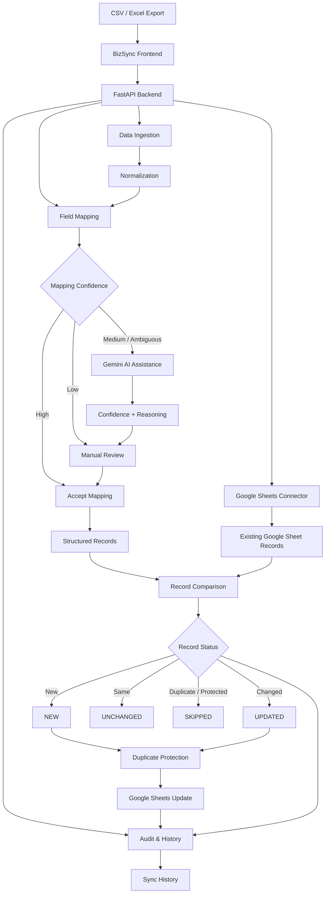
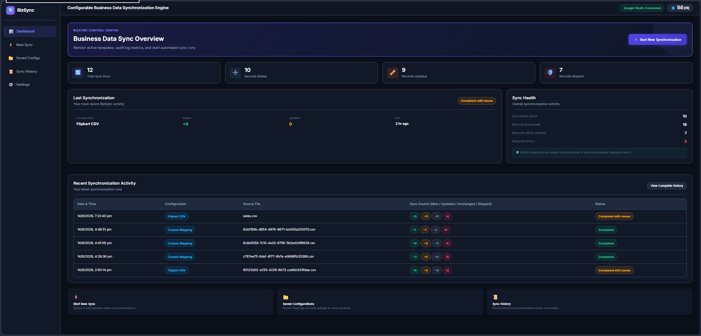
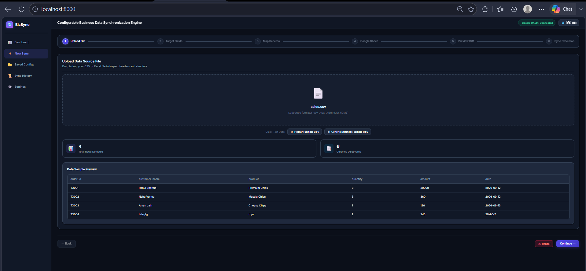
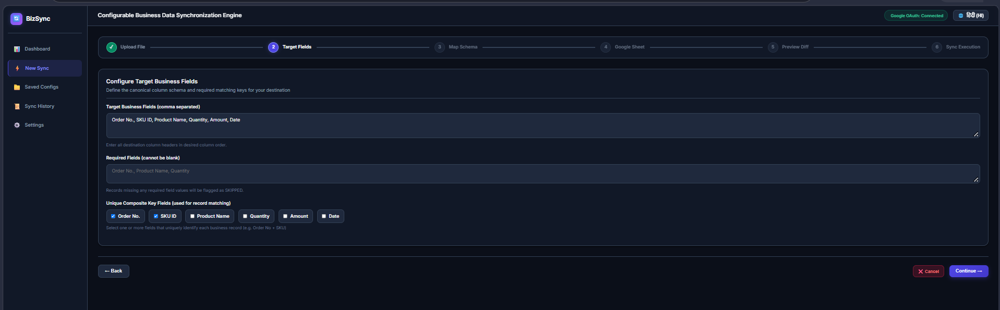
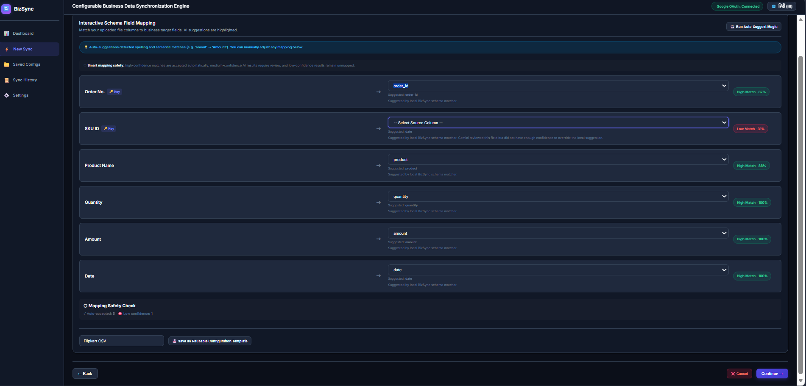
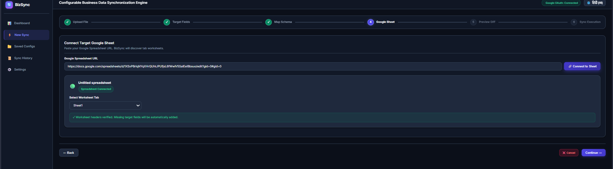
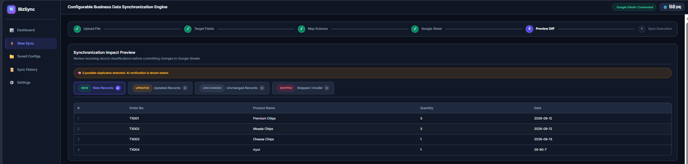
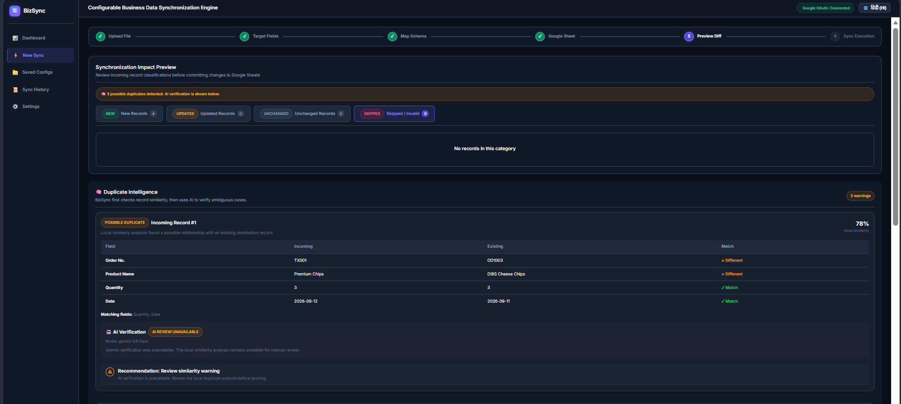
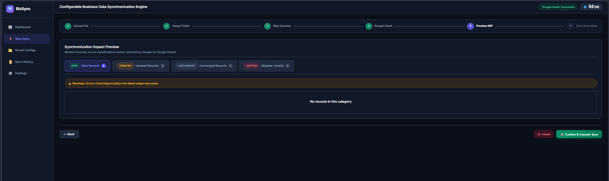
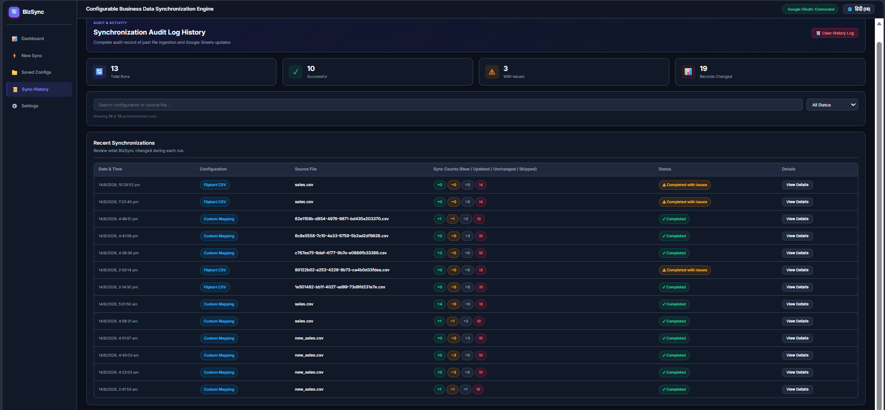

# BizSync

> Configurable business data synchronization engine that transforms CSV/Excel exports into structured, safely synchronized records in Google Sheets.

[](https://github.com/Kevalminda/bizsync/actions/workflows/ci.yml)

BizSync is a configurable business-data synchronization tool built for recurring CSV/Excel workflows.

It helps users:

- Import business exports
- Normalize inconsistent column names
- Map source fields to target fields
- Use AI assistance for ambiguous mappings
- Compare records with existing Google Sheet data
- Identify new, updated, unchanged, and skipped records
- Prevent duplicate records
- Maintain synchronization history
- Reuse saved synchronization configurations

The initial use case focuses on marketplace-style exports such as Flipkart CSV files, while the underlying synchronization engine is designed to support different business datasets and configurable schemas.

---

# 🚀 Why BizSync?

Many businesses receive recurring data exports from marketplaces, inventory systems, CRMs, accounting platforms, or other tools.

A typical manual workflow looks like:

```text
Export CSV / Excel
        ↓
Open spreadsheet
        ↓
Clean column names
        ↓
Understand what each column means
        ↓
Match columns manually
        ↓
Compare with existing records
        ↓
Find new / changed records
        ↓
Check for duplicates
        ↓
Update the master spreadsheet
```

Repeating this process can be time-consuming and error-prone.

BizSync turns this into a structured synchronization workflow:

```text
CSV / Excel Export
        ↓
Data Ingestion
        ↓
Normalization
        ↓
Field Mapping
(Local + AI-assisted)
        ↓
Google Sheets
        ↓
Record Comparison
        ↓
Duplicate Protection
        ↓
NEW / UPDATED / UNCHANGED / SKIPPED
        ↓
Safe Synchronization
        ↓
Audit History
```

---

# ✨ Key Features

## 📥 CSV / Excel Ingestion

BizSync supports common business export formats:

- CSV
- XLSX
- XLSM

Uploaded files are parsed and converted into a normalized structure before synchronization.

---

## 🧩 Configurable Field Mapping

BizSync is not permanently tied to one source platform or one column layout.

Users can define target business fields and map incoming source columns to those fields.

Example:

```text
order_id       → Order No.
sku            → SKU ID
product_name   → Product Name
quantity       → Quantity
amount         → Amount
order_date     → Date
```

This makes the synchronization engine reusable across different business datasets.

---

## 🤖 AI-Assisted Schema Mapping

BizSync uses a hybrid approach combining deterministic matching with AI assistance.

```text
Incoming Columns
       │
       ▼
Deterministic Mapper
       │
       ▼
High-confidence match?
      / \
    Yes   No
     │     │
     ▼     ▼
  Accept   AI Assistance
              │
              ▼
        Confidence Evaluation
              │
          ┌───┴───┐
          ▼       ▼
        Accept   Review
```

AI is primarily used when column names are ambiguous.

For example, a source file may contain:

```text
buyer_ref
article
units_dispatched
gross_total
recorded_at
description
```

BizSync can interpret these into business-oriented target fields such as:

```text
buyer_ref         → Order No.
article           → SKU ID
description       → Product Name
units_dispatched  → Quantity
gross_total       → Amount
recorded_at       → Date
```

AI suggestions include confidence information and reasoning.

---

## 🛡️ Mapping Safety

BizSync does not blindly accept AI-generated mappings.

Mapping decisions are evaluated using confidence levels:

```text
HIGH
  ↓
Automatically accepted

MEDIUM
  ↓
Review recommended

LOW
  ↓
Remain unmapped
```

Users can manually override any mapping.

This keeps AI as an assistance layer instead of allowing uncertain AI decisions to silently modify business data.

---

## 📊 Google Sheets Integration

Users connect BizSync to a Google Sheet using its URL and select the destination worksheet/tab.

In Google Sheets mode, the existing Google Sheet acts as the master/destination dataset.

The user does not need to repeatedly upload a separate "existing records" CSV.

Workflow:

```text
User CSV / Excel
       ↓
     BizSync
       ↓
User's Google Sheet
       ↓
Read existing records
       ↓
Compare incoming records
       ↓
Synchronize required changes
```

---

## 🧱 Automatic Destination Schema

### Empty Google Sheet

When the selected worksheet is empty:

```text
Configured Target Fields
          ↓
      Create Headers
          ↓
     Insert Initial Data
```

BizSync automatically creates the destination headers based on the target schema.

### Existing Google Sheet

When the sheet already contains records, BizSync attempts to intelligently match existing headers.

Common variations such as:

```text
Order No.
order_no
order number
Order-No
```

can be normalized for matching.

Minor naming variations and spelling differences can also be considered during schema matching.

Genuinely missing target columns can be added without deleting existing destination data.

---

## 🔄 Smart Record Comparison

BizSync classifies incoming records into synchronization states:

| Status | Meaning |
|---|---|
| NEW | Record does not exist in the destination |
| UPDATED | Record exists but relevant values changed |
| UNCHANGED | Record already matches the destination |
| SKIPPED | Record is intentionally prevented from being written |

Example:

```text
Incoming Records   100
NEW                 12
UPDATED              8
UNCHANGED           75
SKIPPED              5
```

Only records that require changes are written.

---

## 🔑 Unique-Key Protection

Users can configure one or more unique-key fields.

For example:

```text
Order No. + SKU ID
```

can identify a unique business record.

Unique keys help BizSync:

- Identify existing records
- Update the correct destination record
- Prevent repeated insertion
- Skip duplicate incoming records

This protects against blindly appending the same records during repeated imports.

---

## 🧠 Duplicate Intelligence

BizSync includes duplicate detection to make automated synchronization safer.

The system can identify possible duplicate records and use AI-assisted verification for uncertain cases.

Possible duplicate cases can be surfaced for review instead of being silently inserted.

Duplicate analysis can display:

- Incoming record
- Existing record
- Field-by-field comparison
- Similarity score
- Matching fields
- Different fields
- AI verification when available
- Recommendation for review

Similarity warnings are intended as decision support and do not represent a guaranteed duplicate determination.

---

## 📜 Synchronization History

BizSync maintains an audit trail for synchronization runs.

History can contain:

```text
Timestamp
Configuration
Incoming File
New Records
Updated Records
Unchanged Records
Skipped Records
Errors
```

The Dashboard and Sync History views provide visibility into previous synchronization activity.

---

## 💾 Saved Configurations

Frequently used synchronization setups can be saved and reused.

A configuration can contain:

```text
Configuration Name
Target Fields
Required Fields
Unique-Key Fields
Source → Target Mapping
```

This reduces repetitive setup for recurring imports.

---

## 📊 Dashboard & Monitoring

BizSync provides a dashboard with synchronization metrics and recent activity.

The dashboard can show:

```text
Total Sync Runs
Records Added
Records Updated
Records Skipped
Recent Synchronizations
Synchronization Health
```

Users can quickly understand the state of their synchronization workflow without inspecting raw logs.

---

## 🌐 English + Hindi Interface

BizSync supports a bilingual interface:

```text
English
Hindi (हिंदी)
```

Language selection applies to the application interface while preserving the original business data values.

---

## 📱 Responsive Interface

The frontend is designed to remain usable across:

- Desktop
- Laptop
- Tablet
- Mobile

---

# 🏗️ System Architecture



---

# 🔐 Security Architecture

BizSync is designed primarily as a local/self-hosted application.

The intended architecture is:

```text
              User's Computer
                    │
                    ▼
             ┌─────────────┐
             │  BizSync UI │
             └──────┬──────┘
                    │
                    ▼
             ┌─────────────┐
             │   FastAPI   │
             │   Backend   │
             └──────┬──────┘
                    │
           ┌────────┴────────┐
           ▼                 ▼
    Google APIs           Gemini API
           │                 │
           ▼                 ▼
 User's Google Sheet    AI Assistance
```

Important security principles:

- Credentials remain server-side
- Gemini API keys are provided through environment variables
- OAuth tokens are kept outside the repository
- Local sync history is excluded from Git
- Temporary uploads are excluded from Git
- Saved private configurations are excluded from Git
- The project root is not exposed as a static directory
- Development CORS is restricted to trusted local origins
- Public CI does not require private Google OAuth credentials
- Credentials and API keys are never stored in frontend source code

---

# 📸 Screenshots

The screenshots below demonstrate the main BizSync workflow and interface.

## Dashboard

The BizSync dashboard provides an overview of synchronization activity, including total runs, records added, records updated, skipped records, synchronization health, and recent activity.



---

## New Synchronization — Upload

The synchronization wizard guides the user through the workflow from file upload to execution.



---

## Target Field Configuration

Users can define canonical target fields, required fields, and composite unique keys used for record matching.



---

## AI-Assisted Field Mapping

BizSync combines deterministic matching with AI assistance for ambiguous column names while exposing confidence levels and mapping reasoning.



---

## Google Sheets Integration

BizSync connects to the user's Google Sheet and synchronizes structured business records into the selected worksheet.



---

## Synchronization Preview

Before applying changes, BizSync presents the predicted synchronization impact across NEW, UPDATED, UNCHANGED, and SKIPPED records.



---

## Duplicate Intelligence

Potential duplicates are analyzed using similarity checks and can be surfaced for review before synchronization.



---

## Synchronization Complete

After execution, BizSync reports the synchronization result and provides actions to open the destination sheet or start another synchronization.



---

## Sync History

The history dashboard provides an audit trail of previous synchronization runs and their results.



---

# 🧠 Technology Stack

## Backend

- Python
- FastAPI
- Pandas
- Pydantic
- RapidFuzz

## Google Integration

- Google Sheets API
- Google Drive API
- Google OAuth 2.0
- GSpread

## AI

- Gemini
- Google Gen AI Python SDK
- Hybrid deterministic + AI-assisted field mapping
- AI-assisted duplicate verification

## Frontend

- HTML
- CSS
- JavaScript
- Responsive UI
- English / Hindi localization

## Development & CI

- Git
- GitHub
- GitHub Actions
- Python virtual environment
- Python unittest

---

# 📁 Project Structure

```text
bizsync/
│
├── .github/
│   └── workflows/
│       └── ci.yml
│
├── app/
│   ├── ai/
│   │   ├── ai_mapper.py
│   │   ├── ai_verifier.py
│   │   └── duplicate_detector.py
│   │
│   ├── api/
│   │   ├── main.py
│   │   ├── schemas.py
│   │   └── routes/
│   │       ├── configs.py
│   │       ├── history.py
│   │       ├── sheets.py
│   │       └── sync.py
│   │
│   ├── connectors/
│   │   ├── base.py
│   │   ├── csv_connector.py
│   │   └── google_sheets.py
│   │
│   ├── audit_log.py
│   ├── config_checker.py
│   ├── ingestion.py
│   ├── normalization.py
│   ├── schema_mapper.py
│   ├── sync_engine.py
│   └── test_*.py
│
├── configs/
│   └── saved/
│
├── docs/
│   ├── ROADMAP.md
│   └── screenshots/
│       ├── dashboard.png
│       ├── upload.png
│       ├── target-fields.png
│       ├── ai-mapping.png
│       ├── google-sheets.png
│       ├── preview.png
│       ├── duplicate-intelligence.png
│       ├── execution-complete.png
│       └── history.png
│
├── frontend/
│   ├── css/
│   ├── js/
│   ├── favicon.svg
│   └── index.html
│
├── sample_data/
│
├── .gitignore
├── LICENSE
├── README.md
├── requirements.txt
└── ...
```

---

# ⚙️ Local Installation

## Prerequisites

You will need:

- Python 3.11 or newer
- Git
- A Google account if you want to test Google Sheets synchronization
- A Gemini API key if you want to test AI-assisted features

---

## 1. Clone the Repository

```bash
git clone https://github.com/Kevalminda/bizsync.git
cd bizsync
```

---

## 2. Create a Virtual Environment

### Windows

```powershell
python -m venv .venv
.venv\Scripts\activate
```

### macOS / Linux

```bash
python3 -m venv .venv
source .venv/bin/activate
```

---

## 3. Install Dependencies

```bash
pip install -r requirements.txt
```

---

# 🧪 Quick Demo / Local Testing

BizSync includes sample datasets that can be used to explore the workflow without using real business data.

Sample files include examples for:

- Normal field mapping
- Ambiguous field mapping
- Duplicate detection
- Updated records
- New records

A basic test flow is:

```text
Upload Sample CSV
       ↓
Configure Target Fields
       ↓
Review Mapping Suggestions
       ↓
Connect Google Sheet
       ↓
Review Synchronization Preview
       ↓
Inspect Duplicate Intelligence
       ↓
Execute Synchronization
       ↓
Review Sync History
```

The core application can be explored locally using the included sample data.

Google Sheets synchronization requires your own Google OAuth configuration.

---

# 🔐 Google Sheets Setup

BizSync uses Google Sheets and Google Drive APIs for spreadsheet synchronization.

For local development:

1. Create a Google Cloud project.
2. Enable:
   - Google Sheets API
   - Google Drive API
3. Configure the OAuth consent screen.
4. Create a Desktop OAuth client.
5. Download the OAuth client credentials.
6. Save the file as:

```text
credentials.json
```

Place it in the project root.

### Never commit:

```text
credentials.json
authorized_user.json
token.json
.env
```

These files are intentionally excluded through `.gitignore`.

---

# 🤖 Gemini Configuration

AI-assisted field mapping and duplicate verification use the Google Gen AI Python SDK with a Gemini API key supplied through an environment variable.

Example for Windows PowerShell:

```powershell
$env:GEMINI_API_KEY="YOUR_API_KEY"
```

Example for macOS/Linux:

```bash
export GEMINI_API_KEY="YOUR_API_KEY"
```

The API key should never be hard-coded into application source code or frontend files.

AI features are intended as an assistance layer. When AI assistance is unavailable, BizSync can use deterministic/local matching and manual review where supported.

---

# ▶️ Running BizSync

Start the FastAPI application:

```bash
python -m uvicorn app.api.main:app --reload --port 8000
```

Then open:

```text
http://localhost:8000
```

FastAPI documentation:

```text
http://localhost:8000/docs
```

Health endpoint:

```text
http://localhost:8000/api/health
```

---

# 🔄 Typical Workflow

### Step 1 — Upload

Upload a CSV or Excel export.

### Step 2 — Configure Fields

Select or define the target fields required for synchronization.

### Step 3 — Map Columns

Use automatic suggestions or manually map source columns.

### Step 4 — Connect Google Sheets

Enter the Google Sheets URL and select the destination worksheet.

### Step 5 — Preview

Review:

```text
NEW
UPDATED
UNCHANGED
SKIPPED
```

and inspect duplicate warnings.

### Step 6 — Execute

Run the synchronization.

### Step 7 — Review History

Open Dashboard or Sync History to review the synchronization result.

---

# 🔄 Synchronization Logic

BizSync does not simply append every uploaded record.

For each incoming record, it determines whether the record is:

```text
NEW
UPDATED
UNCHANGED
SKIPPED
```

### Example

Existing Google Sheet:

| Order No. | Product Name | Quantity |
|---|---|---:|
| TX001 | Premium Chips | 3 |
| TX002 | Masala Chips | 3 |

Incoming file:

| Order No. | Product Name | Quantity |
|---|---|---:|
| TX001 | Premium Chips | 3 |
| TX002 | Masala Chips | 4 |
| TX003 | Cheese Chips | 1 |

BizSync can classify the records as:

```text
TX001 → UNCHANGED
TX002 → UPDATED
TX003 → NEW
```

Only the required changes are written to the destination.

---

# 🔑 Unique-Key Matching

Users can configure one or more fields as unique keys.

For example:

```text
Order No. + SKU ID
```

These fields are used to determine whether an incoming record corresponds to an existing destination record.

This prevents a repeated upload from blindly creating duplicate rows.

---

# 🧠 AI Safety Model

AI-assisted mapping follows a confidence-based approach.

Conceptually:

```text
                 Source Column
                       │
                       ▼
              Local Schema Matching
                       │
             ┌─────────┴─────────┐
             │                   │
        High Confidence      Ambiguous
             │                   │
             ▼                   ▼
       Accept Suggestion     Gemini Assist
                                 │
                       ┌─────────┴─────────┐
                       │                   │
                  High Confidence      Lower Confidence
                       │                   │
                       ▼                   ▼
                   Suggest            Manual Review
```

This prevents low-confidence AI guesses from silently becoming synchronization decisions.

---

# 🛡️ Safety Considerations

BizSync includes several safeguards:

- Required-field validation
- Unique-key matching
- Duplicate protection
- Record classification before execution
- Confidence-based mapping
- Manual mapping override
- Preview before synchronization
- Invalid-record handling
- Synchronization history
- Local fallback when AI assistance is unavailable

The goal is to make synchronization reviewable and predictable rather than blindly automated.

---

# 🧪 Testing

BizSync includes automated offline unit tests and separate integration tests.

## Offline CI Tests

The public GitHub Actions workflow runs tests that do not require private Google credentials or external account access.

Run the same offline test suite locally with:

```bash
python -m unittest -v app.test_api app.test_duplicate_detector
```

These tests cover:

- API health behavior
- Configuration endpoint behavior
- Sample-data loading
- Field-mapping endpoint behavior
- Duplicate detection

The CI workflow also compiles the Python application before running the tests.

Compile check:

```bash
python -m compileall -q app
```

---

## Google Sheets Integration Tests

Google Sheets integration tests require local Google OAuth credentials.

These tests are intentionally not executed in public CI because they require access to a real Google account and spreadsheet.

After configuring local credentials, integration tests can be run locally using the project's Google Sheets test scripts.

Required local files include:

```text
credentials.json
authorized_user.json
```

These files must never be committed to the repository.

---

## Test Architecture

```text
                         BizSync Tests
                              │
                 ┌────────────┴────────────┐
                 │                         │
                 ▼                         ▼
          Offline Unit Tests       Integration Tests
                 │                         │
                 ▼                         ▼
          GitHub Actions CI         Local Environment
                                   + Google OAuth
                                   + Google Sheets
                 │
                 ▼
              Safe CI
```

---

# 🔒 Security

Sensitive local credentials are intentionally excluded from the repository.

The `.gitignore` includes:

```text
credentials.json
authorized_user.json
token.json
.env
.env.*
```

Local runtime data such as logs, saved configurations, and temporary uploads are also excluded where appropriate.

### Important

Never commit:

- Google OAuth credentials
- OAuth tokens
- Gemini API keys
- `.env` files containing secrets
- Personal business data
- Private customer information

---

# ⚠️ Known Limitations

BizSync is currently a local portfolio/MVP application, not a production SaaS platform.

Current limitations include:

- No hosted production environment
- Google Sheets integration requires user-provided OAuth configuration
- Gemini features require an API key
- Processing is currently memory-based
- Duplicate intelligence provides similarity warnings rather than guaranteed duplicate decisions
- No multi-user authentication
- No user-level data isolation
- Limited Google Sheets concurrency/conflict handling
- Large-scale production workloads would require further optimization
- More extensive validation would be required for highly varied business datasets

These limitations are areas for future development.

---

# 📌 Initial Use Case

The initial real-world workflow focuses on marketplace-style exports.

Example:

```text
Marketplace Export
        ↓
      CSV File
        ↓
      BizSync
        ↓
    Field Mapping
        ↓
   Record Comparison
        ↓
  Duplicate Protection
        ↓
   Google Sheets
```

A typical dataset might contain:

```text
Order No.
SKU ID
Product Name
Quantity
Amount
Date
```

The synchronization engine, however, remains configurable and can be adapted to other business datasets.

---

# 🎯 Project Goals

BizSync is being developed as a practical automation and data-engineering project focused on:

- Business workflow automation
- Data ingestion
- Data normalization
- Schema mapping
- AI-assisted data understanding
- Record comparison
- Duplicate prevention
- API integration
- Google Sheets automation
- Auditability
- Security-conscious application design

---

# 🏆 Project Highlights

BizSync demonstrates practical implementation of:

```text
Data Engineering
      +
API Integration
      +
Automation
      +
AI-assisted Decision Support
      +
Duplicate Prevention
      +
Auditability
      +
Security-conscious Application Design
      +
Automated CI Testing
```

The project was developed as a practical synchronization workflow rather than only a static UI demonstration.

It includes:

- Configurable target schemas
- Deterministic and AI-assisted mapping
- Confidence-based mapping safety
- Record-level synchronization logic
- Unique-key protection
- Duplicate intelligence
- Google Sheets integration
- Saved configurations
- Synchronization history
- Responsive UI
- Bilingual interface
- Automated CI verification

---

# 📊 Project Status

**Status:** Portfolio / MVP

The current implementation demonstrates:

- End-to-end CSV/Excel ingestion
- Configurable schema mapping
- AI-assisted mapping
- Google OAuth integration
- Google Sheets synchronization
- Deterministic record comparison
- Duplicate protection
- Duplicate intelligence
- Saved configurations
- Synchronization history
- Automated CI testing

The project is functional for local experimentation and portfolio demonstration, while production-scale deployment would require additional infrastructure and security work.

---

# 🗺️ Roadmap

Potential future improvements include:

- [ ] Hosted web application
- [ ] User authentication
- [ ] Multi-user data isolation
- [ ] Database-backed configuration storage
- [ ] Secure cloud credential management
- [ ] More connectors beyond Google Sheets
- [ ] Scheduled synchronization
- [ ] Webhook/event-based synchronization
- [ ] Advanced data validation
- [ ] Large-file / chunked processing
- [ ] Improved duplicate resolution
- [ ] More comprehensive integration testing
- [ ] Deployment monitoring and observability

See [`docs/ROADMAP.md`](docs/ROADMAP.md) for the current roadmap.

---

# 🔮 Future Connector Architecture

BizSync is designed around a connector-based approach so that the destination does not have to remain limited to Google Sheets.

Conceptually:

```text
                    BizSync
                       │
              Synchronization Engine
                       │
          ┌────────────┼────────────┐
          │            │            │
          ▼            ▼            ▼
    Google Sheets     CSV        Future APIs
                                  / Databases
```

This makes it possible to extend the system toward other business-data destinations in the future.

---

# 🤝 Contributing

Suggestions, bug reports, and improvements are welcome.

If you find an issue:

1. Open an issue in the repository
2. Describe the problem
3. Include reproducible steps where possible
4. Mention your environment and relevant error messages

For code contributions:

```bash
git checkout -b feature/your-feature
```

Make your changes, test them locally, and submit a pull request.

---

# 📄 License

This project is licensed under the MIT License.

See [LICENSE](LICENSE) for details.

---

# 👨‍💻 Author

**Keval Minda**

B.Tech — Information Technology

GitHub: [@Kevalminda](https://github.com/Kevalminda)

Project Repository:

https://github.com/Kevalminda/bizsync

---

## ⭐ If You Find This Project Interesting

Feel free to explore the code, test the sample workflows, open an issue, or suggest improvements.

Built as a practical project to explore:

**Python • FastAPI • Data Synchronization • Google APIs • OAuth • Gemini • Automation • Testing**
