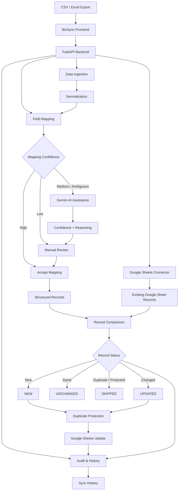

# BizSync

> Configurable business data synchronization engine that transforms CSV/Excel exports into structured, safely synchronized records in Google Sheets.

BizSync is a configurable business-data synchronization tool built for recurring CSV/Excel workflows.

It helps users:

- import business exports
- normalize inconsistent column names
- map source fields to target fields
- use AI assistance for ambiguous mappings
- compare incoming records with existing Google Sheet data
- identify new, updated, unchanged, and skipped records
- prevent duplicate records
- maintain synchronization history
- reuse saved synchronization configurations

The initial use case focuses on marketplace-style exports such as Flipkart CSV files, while the underlying synchronization engine is designed to support different business datasets and configurable schemas.

---

## 🚀 Why BizSync?

Many businesses receive recurring data exports from marketplaces, inventory systems, CRMs, accounting platforms, or other tools.

A typical manual workflow looks like:

```text
Export CSV / Excel
        ↓
Open spreadsheet
        ↓
Clean column names
        ↓
Understand what each column means
        ↓
Match columns manually
        ↓
Compare with existing records
        ↓
Find new / changed records
        ↓
Check for duplicates
        ↓
Update the master spreadsheet
```

Repeating this process can be time-consuming and error-prone.

BizSync turns this into a structured synchronization workflow:

```text
CSV / Excel Export
        ↓
Data Ingestion
        ↓
Normalization
        ↓
Field Mapping
(Local + AI-assisted)
        ↓
Google Sheets
        ↓
Record Comparison
        ↓
Duplicate Protection
        ↓
NEW / UPDATED / UNCHANGED / SKIPPED
        ↓
Safe Synchronization
        ↓
Audit History
```

---

# ✨ Key Features

## 📥 CSV / Excel Ingestion

BizSync supports common business export formats:

- CSV
- XLSX
- XLSM

Uploaded files are parsed and converted into a normalized structure before synchronization.

---

## 🧩 Configurable Field Mapping

BizSync is not permanently tied to one source platform or one column layout.

Users can define target business fields and map incoming source columns to those fields.

Example:

```text
order_id       → Order No.
sku            → SKU ID
product_name   → Product Name
quantity       → Quantity
amount         → Amount
order_date     → Date
```

This makes the synchronization engine reusable across different business datasets.

---

## 🤖 AI-Assisted Schema Mapping

BizSync uses a hybrid approach combining deterministic matching with AI assistance.

```text
Incoming Columns
       │
       ▼
Deterministic Mapper
       │
       ▼
High-confidence match?
      / \
    Yes   No
    │      │
    ▼      ▼
 Accept   AI Assistance
              │
              ▼
       Confidence Evaluation
              │
        ┌─────┴─────┐
        ▼           ▼
      Accept      Review
```

AI is primarily used when column names are ambiguous.

For example, a source file may contain:

```text
buyer_ref
article
units_dispatched
gross_total
recorded_at
description
```

BizSync can interpret these into business-oriented target fields such as:

```text
buyer_ref         → Order No.
article            → SKU ID
description        → Product Name
units_dispatched   → Quantity
gross_total        → Amount
recorded_at        → Date
```

AI suggestions include confidence information and reasoning.

---

## 🛡️ Mapping Safety

BizSync does not blindly accept AI-generated mappings.

Mapping decisions are evaluated using confidence levels:

```text
HIGH
  ↓
Automatically accepted

MEDIUM
  ↓
Review recommended

LOW
  ↓
Remain unmapped
```

Users can manually override any mapping.

This keeps AI as an assistance layer instead of allowing uncertain AI decisions to silently modify business data.

---

## 📊 Google Sheets Integration

Users connect BizSync to a Google Sheet using its URL and select the destination worksheet/tab.

In Google Sheets mode, the existing Google Sheet acts as the master/destination dataset.

The user does not need to repeatedly upload a separate "existing records" CSV.

Workflow:

```text
User CSV / Excel
       ↓
     BizSync
       ↓
User's Google Sheet
       ↓
Read existing records
       ↓
Compare incoming records
       ↓
Synchronize required changes
```

---

## 🧱 Automatic Destination Schema

### Empty Google Sheet

When the selected worksheet is empty:

```text
Configured Target Fields
          ↓
     Create Headers
          ↓
    Insert Initial Data
```

BizSync automatically creates the destination headers based on the target schema.

### Existing Google Sheet

When the sheet already contains records, BizSync attempts to intelligently match existing headers.

Common variations such as:

```text
Order No.
order_no
order number
Order-No
```

can be normalized for matching.

Genuinely missing target columns can be added without deleting existing destination data.

---

## 🔄 Smart Record Comparison

BizSync classifies incoming records into synchronization states:

| Status | Meaning |
|---|---|
| NEW | Record does not exist in the destination |
| UPDATED | Record exists but relevant values changed |
| UNCHANGED | Record already matches the destination |
| SKIPPED | Record is intentionally prevented from being written |

Example:

```text
Incoming Records   100
NEW                 12
UPDATED              8
UNCHANGED           75
SKIPPED              5
```

Only records that require changes are written.

---

## 🔑 Unique-Key Protection

Users can configure one or more unique-key fields.

For example:

```text
Order No. + SKU ID
```

can identify a unique business record.

Unique keys help BizSync:

- identify existing records
- update the correct destination record
- prevent repeated insertion
- skip duplicate incoming records

---

## 🧠 Duplicate Intelligence

BizSync includes duplicate detection to make automated synchronization safer.

The system can identify possible duplicate records and use AI-assisted verification for uncertain cases.

Possible duplicate cases can be surfaced for review instead of being silently inserted.

This provides an additional safety layer around automated data synchronization.

---

## 📜 Synchronization History

BizSync maintains an audit trail for synchronization runs.

History can contain:

```text
Timestamp
Configuration
Incoming File
New Records
Updated Records
Unchanged Records
Skipped Records
Errors
```

The Dashboard and Sync History views provide visibility into previous synchronization activity.

---

## 💾 Saved Configurations

Frequently used synchronization setups can be saved and reused.

A configuration can contain:

```text
Configuration Name
Target Fields
Required Fields
Unique-Key Fields
Source → Target Mapping
```

This reduces repetitive setup for recurring imports.

---

## 📊 Dashboard & Monitoring

BizSync provides a dashboard with synchronization metrics and recent activity.

The dashboard can show:

```text
Total Sync Runs
Records Added
Records Updated
Records Skipped
Recent Synchronizations
Synchronization Health
```

Users can quickly understand the state of their synchronization workflow without inspecting raw logs.

---

## 🌐 English + Hindi Interface

BizSync supports a bilingual interface:

```text
English
Hindi (हिंदी)
```

Language selection applies to the application interface while preserving the original business data values.

---

## 📱 Responsive Interface

The frontend is designed to remain usable across:

- Desktop
- Laptop
- Tablet
- Mobile

---

# 🏗️ System Architecture



---

# 🔐 Security Architecture

BizSync is designed primarily as a local/self-hosted application.

The intended architecture is:

```text
              User's Computer
                    │
                    ▼
             ┌─────────────┐
             │  BizSync UI │
             └──────┬──────┘
                    │
                    ▼
             ┌─────────────┐
             │   FastAPI   │
             │   Backend   │
             └──────┬──────┘
                    │
          ┌─────────┴─────────┐
          ▼                   ▼
   Google APIs             Gemini API
          │                   │
          ▼                   ▼
 User's Google Sheet    AI Assistance
```

Important security principles:

- credentials remain server-side
- Gemini API keys are provided through environment variables
- OAuth tokens are kept outside the repository
- local sync history is excluded from Git
- temporary uploads are excluded from Git
- saved private configurations are excluded from Git
- the project root is not exposed as a static directory
- development CORS is restricted to trusted local origins

---

# 🔒 Privacy & Data Handling

BizSync is primarily designed to run locally.

When another user runs BizSync:

```text
Their CSV / Excel
       ↓
Their BizSync instance
       ↓
Their Google account
       ↓
Their Google Sheet
```

Their local synchronization environment is separate from the developer's local environment.

The GitHub repository does not contain:

- OAuth credentials
- OAuth refresh tokens
- Gemini API keys
- local synchronization history
- temporary uploads
- saved private configurations

### Important

Do not commit real:

- customer information
- financial information
- order records
- private business data
- authentication credentials

Use synthetic/demo data for public examples.

### External Services

When Google Sheets or Gemini functionality is used, relevant data may be sent to those services as required by the selected workflow.

Users should understand the data-sharing implications of connected external services before using BizSync with sensitive business information.

---

# 🧠 Technology Stack

## Backend

- Python
- FastAPI
- Pandas

## Google Integration

- Google Sheets API
- Google Drive API
- Google OAuth 2.0

## AI

- Gemini
- Hybrid deterministic + AI-assisted field mapping
- AI-assisted duplicate verification

## Frontend

- HTML
- CSS
- JavaScript
- Responsive UI
- English / Hindi localization

## Development

- Git
- GitHub
- Python virtual environment

---

# 📁 Project Structure

```text
bizsync/
│
├── app/
│   ├── ai/
│   │   ├── ai_mapper.py
│   │   ├── ai_verifier.py
│   │   └── duplicate_detector.py
│   │
│   ├── api/
│   │   ├── main.py
│   │   ├── schemas.py
│   │   └── routes/
│   │       ├── configs.py
│   │       ├── history.py
│   │       ├── sheets.py
│   │       └── sync.py
│   │
│   ├── connectors/
│   │   ├── base.py
│   │   ├── csv_connector.py
│   │   └── google_sheets.py
│   │
│   ├── audit_log.py
│   ├── config_checker.py
│   ├── deduplication.py
│   ├── ingestion.py
│   ├── list_google_sheets.py
│   ├── mapping.py
│   ├── models.py
│   ├── normalization.py
│   ├── pipeline.py
│   ├── schema_mapper.py
│   ├── sync_engine.py
│   ├── validation.py
│   └── test_*.py
│
├── configs/
│
├── docs/
│   └── ROADMAP.md
│
├── frontend/
│   ├── css/
│   ├── js/
│   ├── favicon.svg
│   └── index.html
│
├── sample_data/
│
├── requirements.txt
├── README.md
└── .gitignore
```

---

# ⚙️ Local Installation

## 1. Clone the repository

```bash
git clone https://github.com/Kevalminda/bizsync.git
cd bizsync
```

## 2. Create a virtual environment

Windows:

```powershell
python -m venv .venv
```

Activate it:

```powershell
.venv\Scripts\activate
```

## 3. Install dependencies

```powershell
pip install -r requirements.txt
```

---

# 🔐 Google Sheets Setup

BizSync uses Google Sheets and Google Drive APIs for spreadsheet synchronization.

For local development:

1. Create a Google Cloud project.
2. Enable:
   - Google Sheets API
   - Google Drive API
3. Configure the OAuth consent screen.
4. Create a Desktop OAuth client.
5. Download the OAuth client credentials.
6. Save the file as:

```text
credentials.json
```

Place it in the project root.

### Never commit:

```text
credentials.json
authorized_user.json
token.json
.env
```

These files are intentionally excluded through `.gitignore`.

---

# 🤖 Gemini Configuration

AI-assisted mapping and duplicate verification use a Gemini API key supplied through an environment variable.

Example for Windows PowerShell:

```powershell
$env:GEMINI_API_KEY="YOUR_API_KEY"
```

The key should never be hard-coded into application source code or frontend files.

---

# ▶️ Running BizSync

Start the FastAPI application:

```powershell
python -m uvicorn app.api.main:app --reload --port 8000
```

Then open:

```text
http://localhost:8000
```

FastAPI documentation:

```text
http://localhost:8000/docs
```

Health endpoint:

```text
http://localhost:8000/api/health
```

---

# 🔄 Typical Workflow

### Step 1 — Upload

Upload a CSV or Excel export.

### Step 2 — Configure Fields

Select or define the target fields required for synchronization.

### Step 3 — Map Columns

Use automatic suggestions or manually map source columns.

### Step 4 — Connect Google Sheets

Enter the Google Sheets URL and select the destination worksheet.

### Step 5 — Preview

Review:

```text
NEW
UPDATED
UNCHANGED
SKIPPED
```

and inspect duplicate warnings.

### Step 6 — Execute

Run the synchronization.

### Step 7 — Review History

Open Dashboard or Sync History to review the synchronization result.

---

# 🧪 Testing

The project contains tests covering areas such as:

- API behavior
- CSV connectors
- field mapping
- normalization
- comparison logic
- duplicate detection
- Google Sheets synchronization
- duplicate protection
- synchronization behavior

Run the test suite with:

```powershell
python -m unittest discover
```

---

# 📌 Initial Use Case

The initial real-world workflow focuses on marketplace-style exports.

Example:

```text
Marketplace Export
        ↓
      CSV File
        ↓
     BizSync
        ↓
Field Mapping
        ↓
Record Comparison
        ↓
Duplicate Protection
        ↓
Google Sheets
```

A typical marketplace dataset might contain:

```text
Order No.
SKU ID
Product Name
Quantity
Amount
Date
```

The synchronization engine, however, remains configurable and can be adapted to other business datasets.

---

# 📸 Screenshots

The project interface includes:

- Dashboard
- New Synchronization wizard
- Field configuration
- AI-assisted mapping
- Google Sheets connection
- Synchronization preview
- Sync history
- Settings

Screenshots can be added to this section as the project presentation is expanded.

Recommended screenshot order:

```text
1. Dashboard
2. Upload / New Sync
3. AI Mapping
4. Google Sheets Connection
5. Preview
6. Sync History
```

---

# 🎯 Project Goals

BizSync is being developed as a practical automation and data-engineering project focused on:

- Business workflow automation
- Data ingestion
- Data normalization
- Schema mapping
- AI-assisted data understanding
- Record comparison
- Duplicate prevention
- API integration
- Google Sheets automation
- Auditability
- Secure local execution

---

# 🚧 Roadmap

Planned improvements include:

- Additional destination connectors
- Additional business-data templates
- More advanced schema matching
- Improved duplicate intelligence
- Scheduled synchronization
- Enhanced reporting
- Hosted deployment
- Multi-user support
- Additional localization options

See [`docs/ROADMAP.md`](docs/ROADMAP.md) for the current roadmap.

---

# 🏆 Project Highlights

BizSync demonstrates practical implementation of:

```text
Data Engineering
      +
API Integration
      +
Automation
      +
AI-assisted Decision Support
      +
Duplicate Prevention
      +
Auditability
      +
Security-conscious Application Design
```

The project was developed as a practical solution rather than a static demonstration, with the synchronization engine tested across local CSV workflows and Google Sheets synchronization scenarios.

---

# 👨‍💻 Author

**Keval Minda**

B.Tech — Information Technology

GitHub:  
https://github.com/Kevalminda

Project Repository:  
https://github.com/Kevalminda/bizsync

---

# 📄 License

License information can be added here before distributing BizSync for broader reuse.